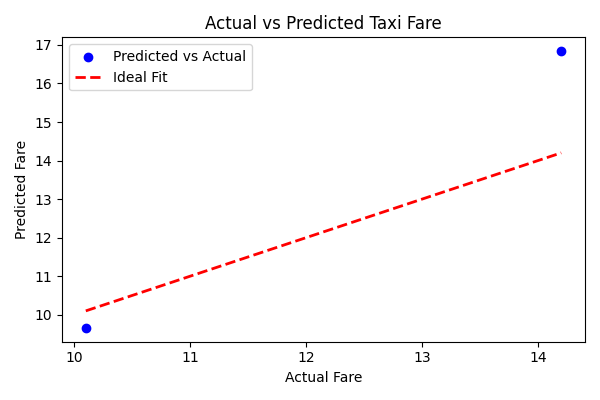

# Chicago Taxi Fare Prediction - Lab Report

## 🎯 Objective
To train a linear regression model that predicts the **fare** of a taxi ride in Chicago using basic trip data.

---

## 📊 Sample Dataset
Used a simple dataset with 10 records and 4 columns:
- `trip_miles`
- `pickup_community_area`
- `dropoff_community_area`
- `fare` (target)

---

## ⚙️ Model Summary
- **Algorithm**: `LinearRegression` from `scikit-learn`
- **Train/Test Split**: 80% training, 20% testing
- **Target Variable**: `fare`

### 🔢 Results
- Intercept: `2.42`
- Coefficients:
  - `trip_miles`: `2.44`
  - `pickup_community_area`: `0.07`
  - `dropoff_community_area`: `0.09`
- Mean Squared Error (MSE): `3.58`

---

## 📈 Actual vs Predicted Plot

The graph below shows the relationship between the actual and predicted fares:

---

##  Conclusion
This basic model successfully demonstrates how trip details can be used to predict fare. More features like time, tips, and distance accuracy would improve predictions with real data.
