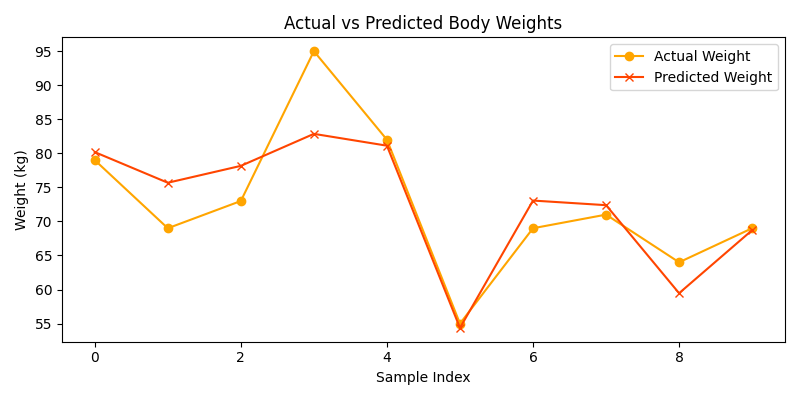

# Linear Regression Lab Report

## 🎯 Objective
To predict the body weight of a person using linear regression based on:
- Height
- Age
- Gender

---

## 📊 Dataset
| Weight | Height | Age | Gender |
|--------|--------|-----|--------|
| 79     | 1.80   | 35  | Male   |
| 69     | 1.68   | 39  | Male   |
| 73     | 1.82   | 25  | Male   |
| 95     | 1.70   | 60  | Male   |
| 82     | 1.87   | 27  | Male   |
| 55     | 1.55   | 18  | Female |
| 69     | 1.50   | 89  | Female |
| 71     | 1.78   | 42  | Female |
| 64     | 1.67   | 16  | Female |
| 69     | 1.64   | 52  | Female |

---

## ⚙️ Preprocessing
- Gender was encoded numerically as:  
  - Male = 1  
  - Female = 0

---

## 🤖 Model
- Used: `LinearRegression` from `sklearn.linear_model`
- Features: `Height`, `Age`, `Gender`
- Target: `Weight`

---

## 📈 Results
- Intercept: **-24.41**
- Coefficients:
  - Height: **47.38**
  - Age: **0.30**
  - Gender: **8.92**

### 🧪 Sample Prediction
For a person with:
- Height = 1.75 m  
- Age = 30  
- Gender = Male (1)

👉 **Predicted Weight** = `76.33 kg`

---

## 🖼️ Actual vs Predicted Graph

This chart compares the actual body weights vs. those predicted by the model:

---

##  Conclusion
The linear regression model was successfully trained and gave good prediction performance on the given dataset.

- Height and Gender were strong predictors of body weight.
- The model can be improved by:
  - Adding more data
  - Including features like body fat %, lifestyle, etc.

This example demonstrates how simple linear regression can be used for predictive health modeling.
